# Capstone: Complex CNN Architectures

---
## Problem Statement

Osborne Research Labs is a recently started research lab. Our lab is conducting research on computer vision systems for drones and robotics. Given we are just entering the field and we have a basic understanding of convolutional neural networks (CNNs), we wanted to research popular complex CNN architecures. The goal of this project is to learn about the pros and cons of three popular CNN architecures and see how they perform on an indoor scene data set. We're hoping for accuracy scores above the baseline of 9%. 

---

## Data

The data used in this project was initially from MIT's Indoor Scene dataset ([data](https://www.kaggle.com/itsahmad/indoor-scenes-cvpr-2019)). This data set consisted of about 15,000 images across 67 different classes. In this project I used 11 classes: Bathroom, Bedroom, Pantry, Corridor, Staircase, Gym, Living Room, Kitchen, Office, Closet, and elevator. The initial dataset was highly unbalance, so I scrapped approximately 500 more images for each class except living room and bedroom from google using a google extension tool ([image downloader](https://chrome.google.com/webstore/detail/image-downloader/cnpniohnfphhjihaiiggeabnkjhpaldj)). This resulted in a total dataset size of approximately 7,000 images split into train, validation, and test sets.

## Summary of Analysis

### VGG16

Developed in 2014 by the Visual Geometry Group at Oxford University. Similar to other popular architectures such as AlexNet, but it's deeper. Consists of 16 weight layers: 13 convolutional layers and 3 fully connected layers. It's popular for it's simplicity and ease of understanding. Only uses convolutional, pooling and dense layers. What makes it simple is that is only uses stacks of 3 x 3 convolutional layers to achieve a deeper network with less computational footprints than predecessors. This model simplified the need to setting up hyperparameters for convolutional and pooling layers. Had a top-5 error rate of 8.1% on the ImageNet dataset.

Had a top accuracy of around 10% on the indoor scene dataset.

Visuals for VGG16:

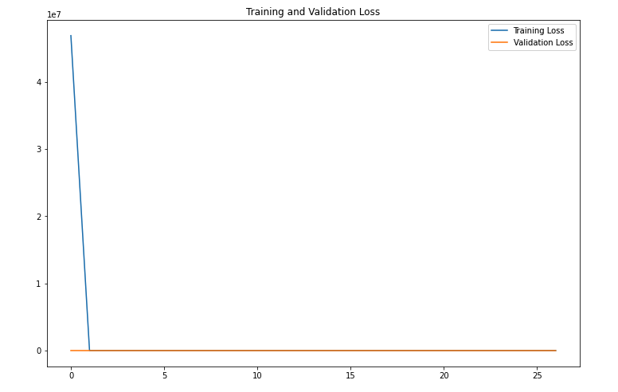
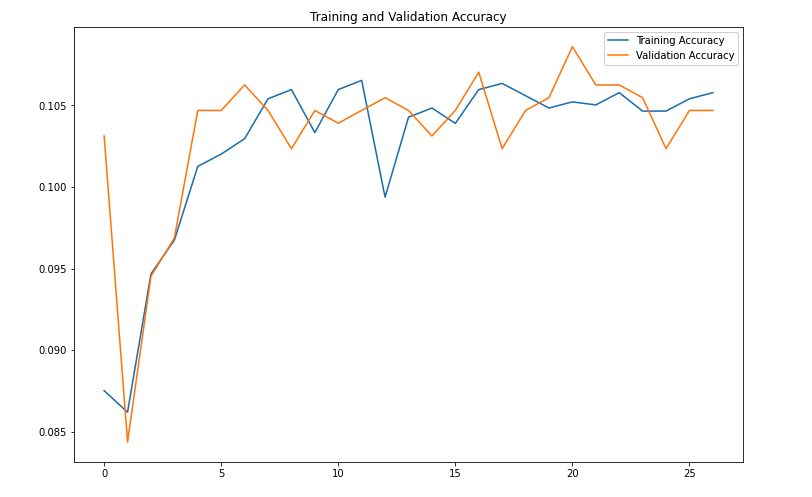
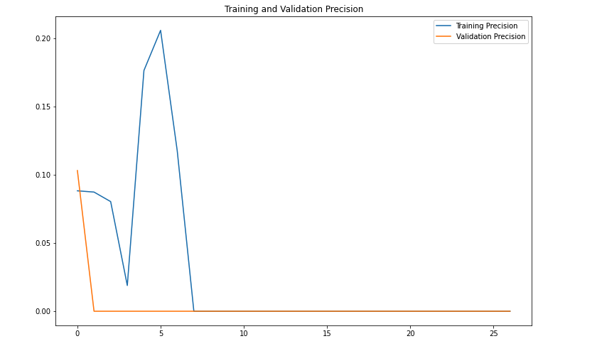
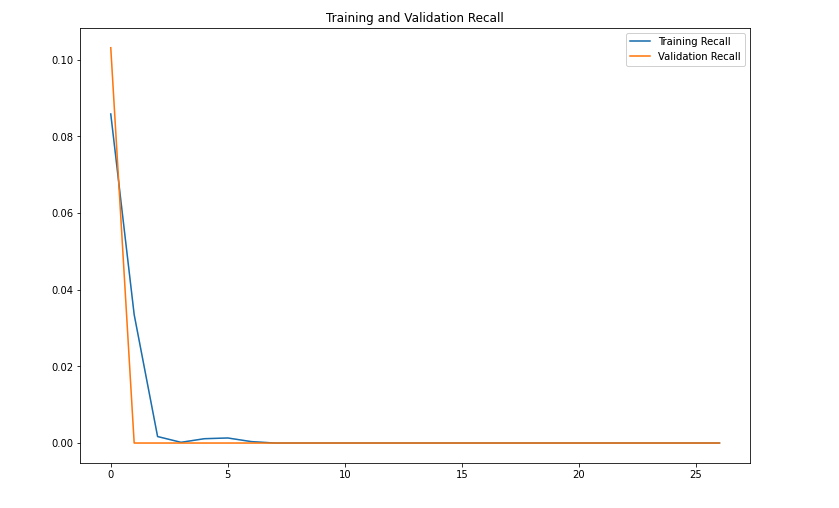

### Inception / GoogleNet

Developed in 2014 by a research group at Google. Network consists of 22 layers, which is deeper than VGG16 while also reducing the number of paramters from ~138 million - ~13 million. Was inspired by AlexNet and VGG16 and introduced a new concept call the Inception Module. The inception module combines all common filter sizes of convolutional layers 1 x 1, 3 x 3, and 5 x 5, and a 3 x 3 pooling layer all into one module. The architecure is then created by combinining layers of these modules together. Had a top-5 error rate of 6.67% on the ImageNet dataset.

Had a top accuracry of around 10.5% on the indoor scene dataset.

Visuals for GoogleNet:

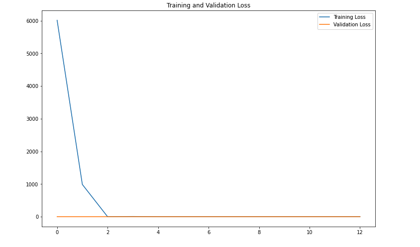
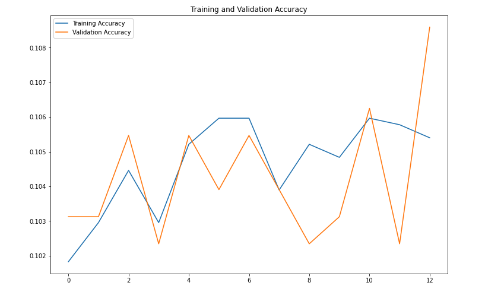
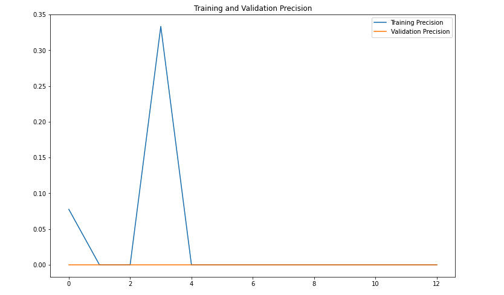
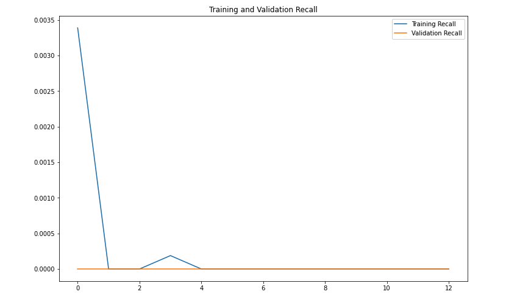

### ResNet

Developed in 2015 by a research group from the Microsoft Research team. This model introduced even deeper convolutional networks with 50, 101, and 152 weight layers. Although very deep this architecture has lower computational complexity than VGG19 (VGGNet with 19 weight layers). Introduced a residual module with skip connections. This helped sovled the problem of vanishing gradients. It had a top-5 error rate of 3.57% on the ImageNet dataset.

Had a top accuracry of around 11% on the indoor scene dataset.

Visuals for ResNet:

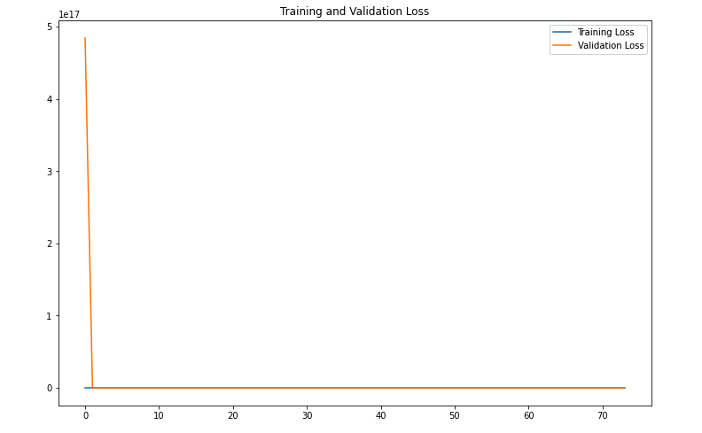
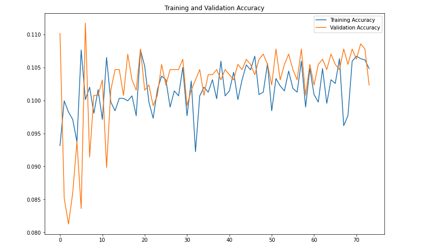
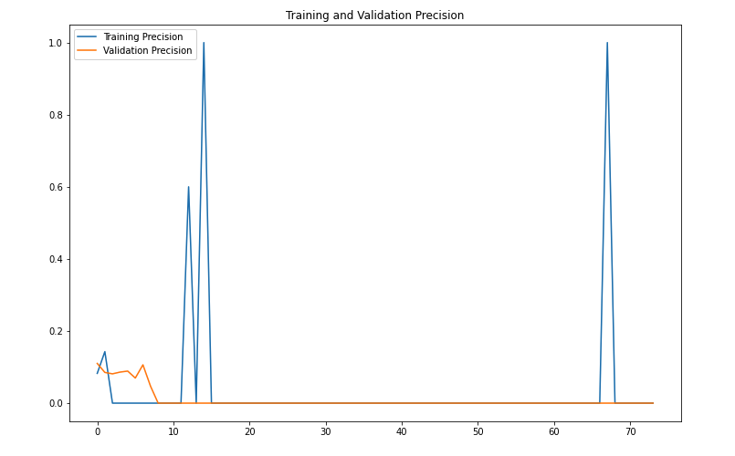
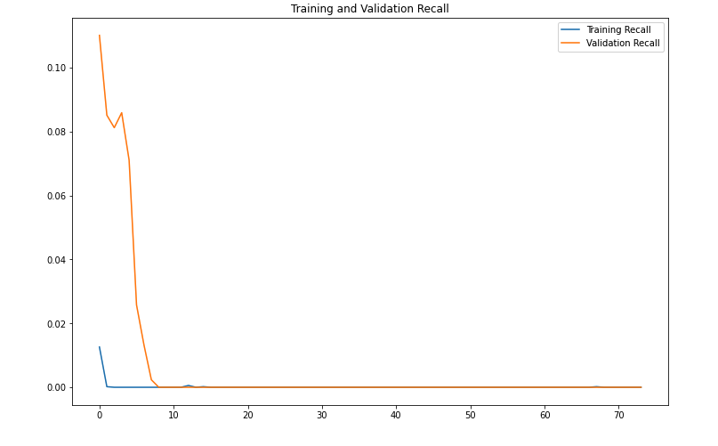

## Conclusions and Further steps

Each architecure solved the problem of creating deep neural networks. VGG16 introduced uniform hyperparameter architecures. Inception introduced inception modules that used a variety of filter sizes for convolutional layers stacked on top of each other. Resnet solved the issue of vanishing gradients and really deep networks by introducing residual modules and skip connections to allow for better flow of the weight information through the network. All three networks performed above the baseline, but did not perform significantly well on the indoor scene data. This shows the importance that not all architecures will transfer well onto other datasets. They are however a good starting point and the ideas in which they introduce can be applied across various datasets. Each model performed the same on the indoor scene test set. Out of the 220 images they each incorrectly guessed 200 images and correctly guessed the same 20 images. All 3 models successfully predicted the bathroom class of images.

Moving forward I would try adding more data to see if there could be better performance with models like Inception and ResNet. Also I would try developing a costum architecture for this dataset using inspiration from Inception and Resnet. I would test to a simpler architecture and slowly increase complexity using concepts like inception and residual modules. 

## Resources

- [VGG16 Research Paper](https://arxiv.org/pdf/1409.1556v6.pdf)
- [Inception and GoogleNet Research Paper](http://mng.bz/YryB)
- [ResNet Research Paper](http://arxiv.org/abs/1512.03385)
- [Demo App Code](https://developer.apple.com/documentation/vision/classifying_images_with_vision_and_core_ml)
- [Tensorflow to CoreML Conversion](https://developer.apple.com/videos/play/wwdc2020/10153/)
- [Deep Learning for Vision Systems by Mohamed Elgendy](https://www.manning.com/books/deep-learning-for-vision-systems)
- [Deep Learning with Python by Francois Chollet](https://www.manning.com/books/deep-learning-with-python)
